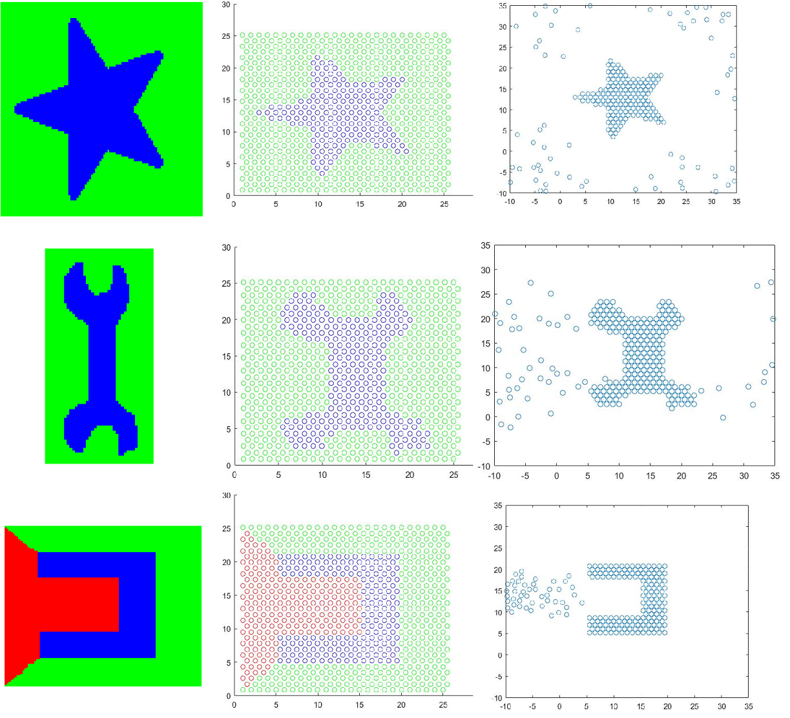

# Self-Disassembly Swarm Robots

This was a project made in 2016 for the MSC in Artificial Intelligence of the Universidad Politécnica de Madrid.

Implementation of [this video](https://www.youtube.com/watch?v=JanDNi4HEEA) using reverse engineering, because at this point the paper used to the original implementation was not public.

The objective is to create an algorithm to make a swarm robots (725 robots) to draw a specific figure using a self-disassembly techniques. The target figure and their position are only known at the beginning by 4 robots. 
Any other robot don't know where they are or the figure they have to form. Each robot can communicate only with a certain number of near robots, so a robot which doesn't know where itself is can guess it by triangulation with the position of near located robots and the distance to them.
Once all the robots know their position and the figure they have to form, they start moving. 
Each robot will behave different according to their position in the reference image:

* If the color is blue, the robot doesn't move at all.
* If the color is green, the robot will escape from the light.
* If the color is red, the robot will get near to the light.

  

## Getting Started

### Prerequisites

All the code was done and tested in Matlab 2016b. 

## Running the tests

To run the algorithm, run the main.m code in Matlab terminal.

To change the target figure, change the value of the variable "img_name" with the path of the new figure. Remember to change the light focus if it is necessary.

## License

This project is licensed under the MIT License - see the [LICENSE.md](LICENSE.md) file for details

## Acknowledgments

* Thanks to "Programmable self-disassembly in large-scale collectives (DARS 2016) by M. Gauci et Al." for the inspiration.
* When I did this project, the paper was not released, so this code is not an implementation of their paper.
* I published the results as a [youtube video](https://www.youtube.com/watch?v=DWzoi9FwFqI).

